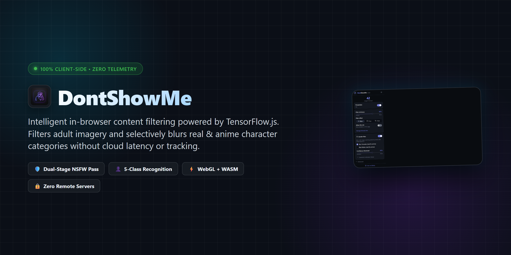
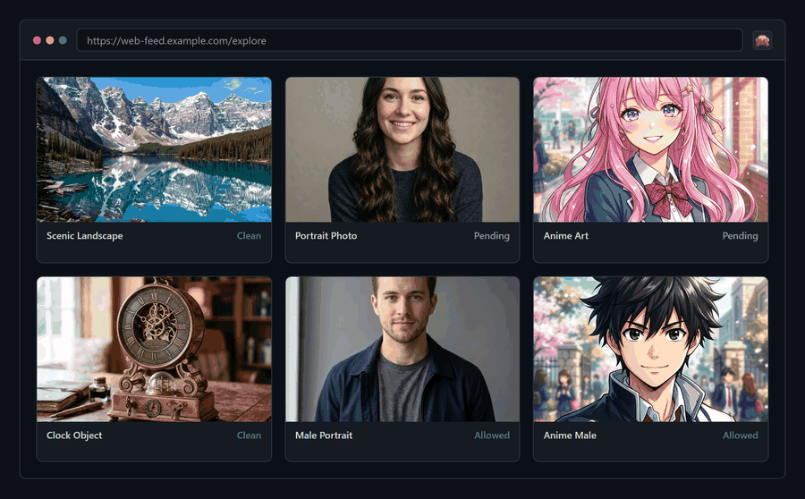
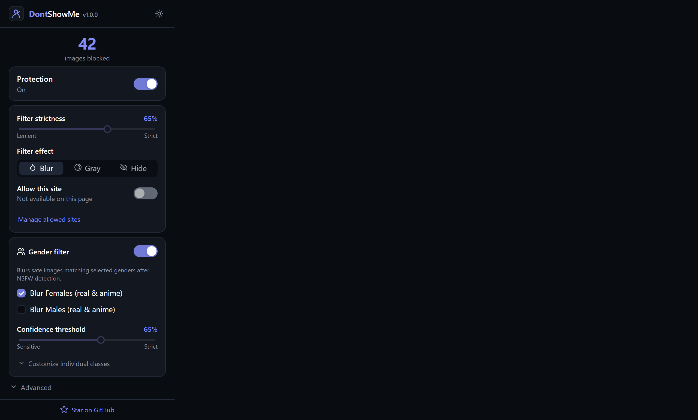
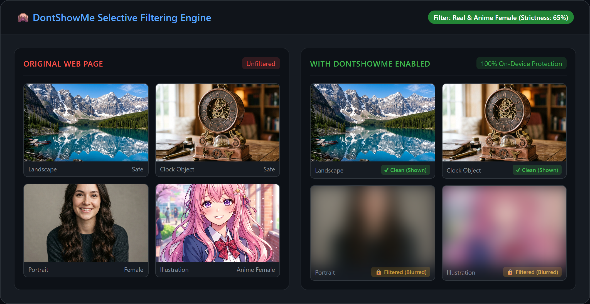
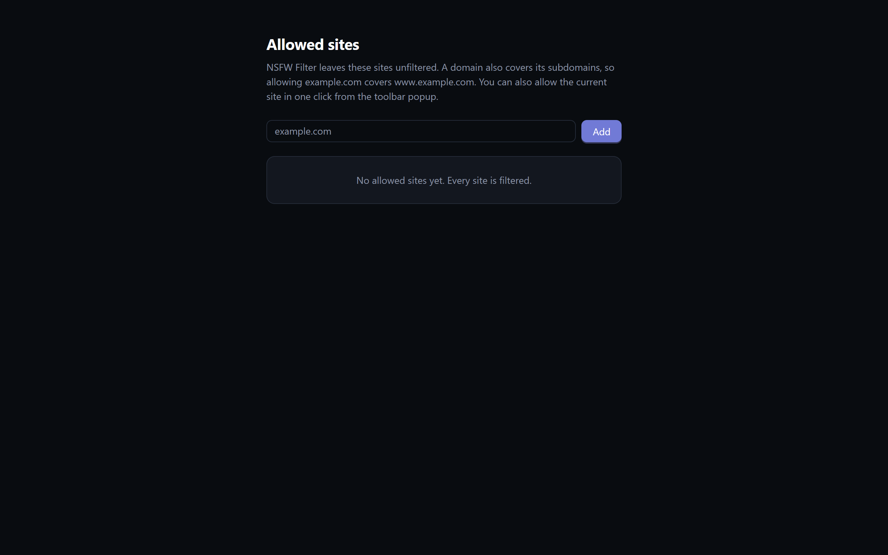
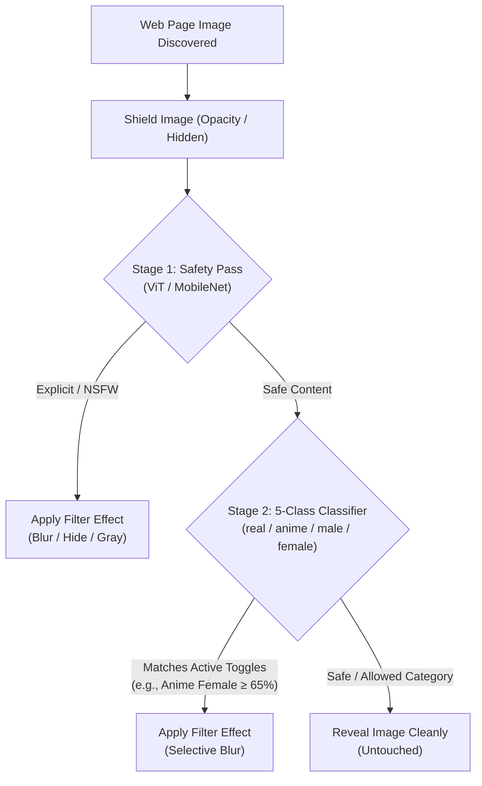

# 🙈 DontShowMe - 100% Client-Side Web Content & Gender Filter

> Filter explicit adult content, blur anime and real character categories, and protect your browsing privacy — 100% on-device with local TensorFlow.js. Zero telemetry. No remote servers. Free & Open Source.

[]()
[](LICENSE)
[]()
[]()
[]()
[]()
[]()
[]()
[](https://github.com/haichteque/dont-show-me/releases/latest)

---

## 📥 Download & How to Install

### Quick Download
👉 **[Download Pre-Packaged ZIP (dontshowme-v1.0.0.zip)](https://github.com/haichteque/dont-show-me/releases/latest/download/dontshowme-v1.0.0.zip)**  
*Store-ready, pre-compiled Manifest V3 package. No Node.js or build tools required.*

### Method 1: Install Pre-Packaged ZIP (Recommended)
1. Download [`dontshowme-v1.0.0.zip`](https://github.com/haichteque/dont-show-me/releases/latest/download/dontshowme-v1.0.0.zip) from the latest release.
2. Extract the ZIP file to a permanent folder on your computer.
3. Open Google Chrome (or any Chromium browser such as Brave, Edge, Opera, or Vivaldi) and navigate to `chrome://extensions`.
4. Enable **Developer mode** using the toggle switch in the top-right corner.
5. Click the **Load unpacked** button in the top-left corner.
6. Select the extracted folder (the directory containing `manifest.json`).
7. Pin **DontShowMe** (🙈) to your browser toolbar for quick access to filtering controls and statistics.

### Method 2: Build & Install from Source
If you are developing, customizing the classification model, or contributing:

```bash
# 1. Clone repository
git clone https://github.com/haichteque/dont-show-me.git
cd dont-show-me

# 2. Install dependencies
npm install

# 3. Build production bundle
npm run build

# 4. Load unpacked in Chrome
# Open chrome://extensions, enable "Developer mode", click "Load unpacked",
# and select the dist/ directory.
```

---

## 💡 Why DontShowMe?

Most traditional content filtering tools rely on crude domain blocklists or send your private browsing history and image URLs to remote third-party cloud APIs for analysis.

**DontShowMe** takes a completely different, privacy-first approach:

- **100% In-Browser Machine Learning**: Neural network inferences execute entirely on your local GPU/CPU via TensorFlow.js (WebGL with automatic CPU WASM SIMD fallback). Zero bytes of image data, URLs, or metadata ever leave your computer.
- **5-Class Fine-Grained Subject Categorization**: Goes far beyond binary adult flags by accurately classifying safe imagery into `real_male`, `real_female`, `anime_male`, `anime_female`, and `other`.
- **False-Positive Mitigation**: Specially tuned heuristics eliminate false-positive blurring on UI buttons, icons, abstract shapes, and fictional alien characters.
- **Complete Autonomy & Offline Capability**: Operates fully offline without accounts, subscriptions, cloud tokens, or network latency.

---

## 🎬 Demo



---

## 📊 Comparison Matrix

| Capability / Feature | Traditional Ad Blockers | Cloud-Based NSFW Filters | **DontShowMe** |
|:---|:---:|:---:|:---|
| **Privacy & Telemetry** | Domain-level only | Uploads image URLs to cloud servers | **100% On-Device (Zero Telemetry)** |
| **Gender & Character Filtering** | ❌ None | ❌ None | **✔ 5-Class Granular Detection** |
| **Anime & Illustrated Support** | ❌ None | ⚠️ High false-positive rate | **✔ Dedicated Anime Classifier** |
| **Explicit Adult Filtering (NSFW)** | ⚠️ Static URL/domain lists | Cloud AI | **✔ Local Dual-Pass (ViT + MobileNet)** |
| **Custom Confidence Tuning** | ❌ None | ❌ Hardcoded thresholds | **✔ Real-Time Slider & Class Toggles** |
| **Offline Operation** | ✔ Yes | ❌ Requires Cloud / API | **✔ WebGL + WASM (Works Offline)** |
| **Hardware Acceleration** | N/A | Server-side | **⚡ In-Browser GPU / SIMD WASM** |
| **License & Price** | Mixed | Freemium / Paid Subscription | **✔ 100% Free & Open Source (GPL-3.0)** |

---

## 🖼️ Interface Showcase

| Modern Dark-Mode Popup | Selective Filtering in Action |
|:---:|:---:|
|  |  |
| *Intuitive popup with protection toggle, strictness slider, effect switcher (Blur, Gray, Hide), and confidence tuning* | *Intelligent blur application: target categories filtered seamlessly while non-person objects remain untouched* |

<div align="center">
  
  <p><em>Advanced Options &amp; Settings page for custom site allowlisting, sensitivity presets, and theme settings</em></p>
</div>

---

## 🚀 Features

### 🛡️ Dual-Stage NSFW Protection
- **ViT (Vision Transformer) & MobileNet v1.2**: Two-tier safety evaluation classifies adult, explicit, hentai, and provocative images.
- **Zero-Flicker Shielding**: Media is shielded upon DOM insertion and revealed only once verified safe, preventing accidental flash of unwanted imagery.

### 👤 5-Class Gender & Character Engine
- **Granular Classification**: Classifies safe images into `real_male`, `real_female`, `anime_male`, `anime_female`, and `other`.
- **Independent Toggles**: Filter exclusively anime imagery, real portraits, females, males, or configure custom class combinations.

### 🎛️ Interactive Controls & Confidence Tuning
- **Confidence Threshold Slider**: Fine-tune classification confidence from 20% to 95% depending on whether you prefer sensitive or strict filtering.
- **Multiple Visual Effects**: Choose between Gaussian **Blur**, **Grayscale**, or full DOM element **Hide**.
- **Per-Site Allowlisting**: Whitelist trusted sites with one click directly from the popup.

### ⚡ Performance & WebGL Acceleration
- **Offscreen Worker Architecture**: Heavy neural network computations are offloaded to a dedicated Chrome Manifest V3 offscreen document, keeping web browsing fluid and stutter-free.
- **Hardware Acceleration**: Automatic WebGL acceleration on supported GPUs with seamless fallback to CPU WebAssembly with SIMD.

---

## 🛠️ Filtering Pipeline & Architecture



---

## 🧰 Tech Stack

| Technology | Purpose |
|---|---|
| [TensorFlow.js](https://www.tensorflow.org/js) | In-browser machine learning execution (WebGL & CPU WASM) |
| [NSFWJS](https://github.com/infinitered/nsfwjs) | MobileNet v1.2 and ViT models for explicit content classification |
| [Custom GraphModel](https://huggingface.co/haichteque/gender4-whole-image-5class) | High-precision 5-class gender and anime character classification |
| [React 19](https://react.dev/) & [Redux](https://redux.js.org/) | Reactive state synchronization across popup, content script, and background worker |
| [Ant Design](https://ant.design/) | Modern dark-themed popup controls, segmented buttons, and sliders |
| [Chrome Manifest V3](https://developer.chrome.com/docs/extensions/mv3/) | Service workers, offscreen documents, and content script pipeline |

**Zero backend. Zero tracking. Zero telemetry. 100% browser-native.**

---

## 🔬 Replacing the Classifier with Your Own Model

The gender classifier model is located in:
```text
dist/models/gender/
├── model.json
├── group1-shard1of3.bin
├── group1-shard2of3.bin
└── group1-shard3of3.bin
```

To substitute your own trained model:

1. **Place Model Files**: Export your model to a TensorFlow.js GraphModel and place the `model.json` and `.bin` shard files in `dist/models/gender/`.
2. **Update Class Definitions**: Open `src/offscreen/classifiers/GenderClassifier.ts` and update `GENDER_CLASSES` to match your model's output labels:
   ```typescript
   export const GENDER_CLASSES: GenderClass[] = [
     'real_male',
     'real_female',
     'anime_male',
     'anime_female',
     'other'
   ]
   ```
3. **Adjust Resolution & Preprocessing**:
   ```typescript
   const INPUT_SIZE = 256 // update to match your model's expected input dimension
   ```
4. **Rebuild**:
   ```bash
   npm run build
   ```

---

## 🔄 Converting Models: ONNX to TensorFlow.js

If you have a model trained in PyTorch or `.onnx` format, convert it to a native TensorFlow.js GraphModel with these steps:

### 1. Install Prerequisites
```bash
pip install onnx onnx2tf tensorflow tensorflowjs
```

### 2. Convert ONNX to TensorFlow SavedModel
Use [`onnx2tf`](https://github.com/PINTO0309/onnx2tf) to export an optimized SavedModel:
```bash
onnx2tf -in model.onnx -o saved_model/ -coion -nuo
```

> **Note for Windows users**: If using TensorFlow 2.21+, ensure `dilations` in depthwise convolution layers are 2D `[dh, dw]` rather than 4D to avoid rank errors during export.

### 3. Convert SavedModel to TensorFlow.js GraphModel
```bash
tensorflowjs_converter \
  --input_format=tf_saved_model \
  --output_format=tfjs_graph_model \
  --weight_shard_size_bytes=4194304 \
  saved_model/ \
  dist/models/gender/
```

This creates `model.json` alongside 4 MB `.bin` binary shard files ready for consumption by TensorFlow.js.

---

## 🧪 Development & Automated Testing

### Running Tests
Every push and pull request triggers continuous integration testing through GitHub Actions.

```bash
# Run Jest unit tests (17 test suites, 169 tests)
npm run test:unit

# Run automated image classification test suite
# (Evaluates NSFW, SFW, Gender, and False Positive image suites)
npm run test:images

# Run complete test suite (Unit + Image Tests + E2E)
npm test

# Run Playwright end-to-end browser verification
npm run test:gender:e2e
```

### CI/CD Pipeline
Continuous integration is configured in `.github/workflows/integrate.yml`:
- Runs on every `push` and `pull_request` to `master` and `main`.
- Validates code linting (`npm run lint`).
- Compiles the production bundle (`npm run build`).
- Executes unit tests (`npm run test:unit`).
- Evaluates the image test suite (`npm run test:images`) across all categories.
- Validates Chrome Web Store compliance (`npm run package:verify`).

---

## 📦 Packaging for Google Chrome Web Store

To produce a production-ready `.zip` package acceptable for uploading to the Chrome Web Store developer dashboard:

```bash
npm run package
```

This script:
1. Builds a fresh production bundle in `dist/`.
2. Validates `manifest.json` schema, Manifest V3 compliance, icons, and permissions.
3. Ensures `manifest.json` is at the root of the archive.
4. Validates that the package size is well within the 128 MB Chrome Web Store limit.
5. Generates the release ZIP file at `package/dontshowme-v1.0.0.zip`.

---

## 👥 Credits & Attribution

- This project is a downstream fork of [**NSFW Filter**](https://github.com/nsfw-filter/nsfw-filter), originally created by [Navendu Pottekkat](https://github.com/navendu-pottekkat), [Yegor Zaremba](https://github.com/YegorZaremba), and the NSFW Filter open-source contributors.
- The default 5-class gender and anime classification weights are based on the [`gender4-whole-image-5class`](https://huggingface.co/haichteque/gender4-whole-image-5class) model by `haichteque`.

---

## 📄 License

This project is licensed under the [GNU General Public License v3.0 (GPL-3.0)](LICENSE).
